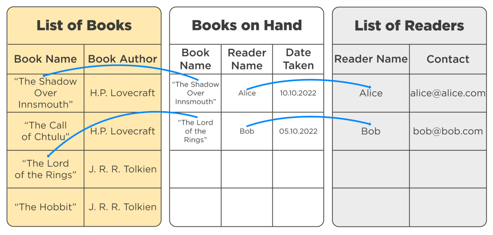
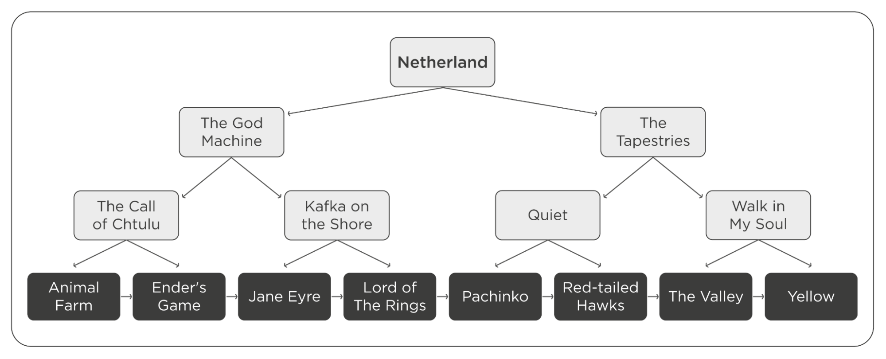
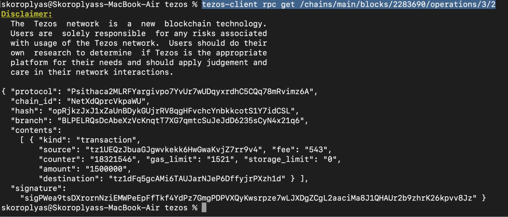
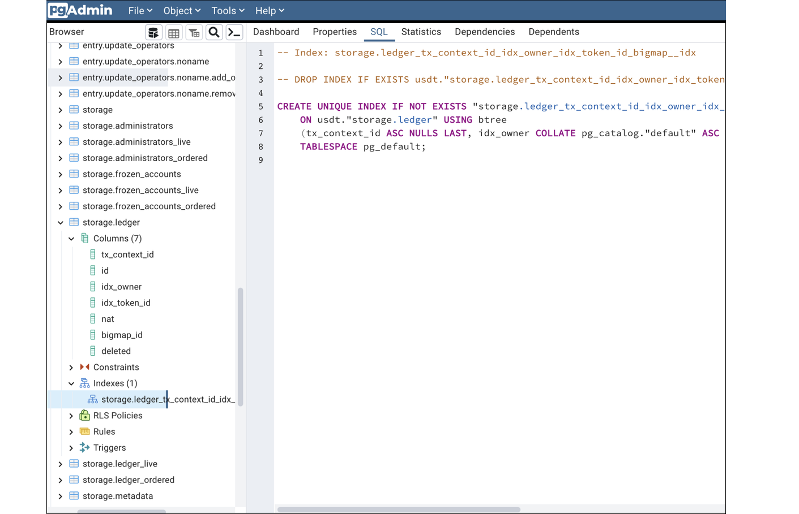
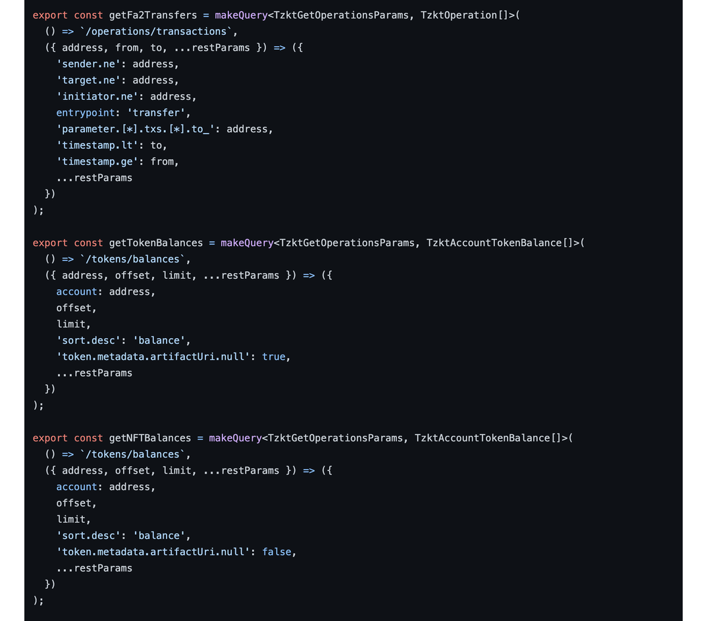
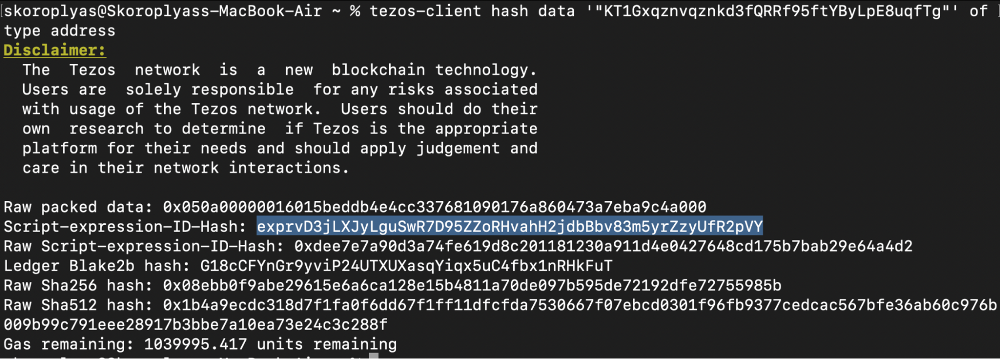

:::info Authors
This content was created by [Tezos Ukraine](https://tezos.org.ua/en) under MIT Licence, and integrated on OpenTezos by Nomadic Labs. The original version can be found [here](https://indexers.tezos.org.ua/) in multiple languages.
:::

# How Blockchain Indexers Work and Why We Need Them

Blockchain Indexers are programs that simplify querying and searching through blockchain data. Almost any decentralized application uses indexers, and if you want to build your dApp, chances are you’ll need to use them too.

This course will cover all you need to know about blockchain indexers: how they work, what kinds of indexers there are, and how to use them with real examples.

## A simple explanation of how indexers work

Indexers are programs for transforming a large amount of information into a database with convenient and fast search. Understanding indexers is easy if we use a library as an example.

There are thousands of books on the shelves in the library. They are usually sorted by genre and authors' names. The reader will quickly find the stand with novels or gardening guidelines.

But let's say the reader wants to find something specific: a poem about an acacia tree, a story about a gas station architect, or all the books written in 1962. They will have to check all the books in the library until they come across what they are looking for.

The librarian got themselves ready for such visitors and compiled a special database. He wrote down the details of each book in separate indexes. For example, one index would list all the names of the characters of every book in alphabetical order and the name of the book where they appear. The second index will contain the key events, and the third—unique terms like “horcruxes” or “shai-hulud,” etc. The librarian can make as many indexes as he needs to simplify the search for a specific book.

Now let’s return to blockchain technologies. To find a transaction by its hash or by the address of the caller, you will have to check every transaction in every block. The best way out is to create a separate database with all the contents of the blockchain with pointers to search for information on specific queries and access it quickly. This is what indexers do.

## Database and Index in Details

A database is a collection of organized data. Usually, tables are used for storage: each row stores values of a specific key, and columns keep values of a particular type.

Sometimes when developers talk about databases, they mean DBMS (database management systems), i.e., software for working with databases. These include MySQL, PostgreSQL, Oracle Database, Microsoft Access, and others. 

Most databases are relational. They sort and write data into tables and create relationships between them. For example, a database for our library might use three tables:

- **List of Books.** Names of all books in the library and information about them;
- **List of Readers.** The name of each reader and their contact details;
- **Books on hand.** A list of books that someone borrowed to read. The cell with the book's title refers to an entry in the List of books, and the cell with the reader's name refers to an entry in the List of Readers.

These tables help store and organize the data. But they don't speed up the search process much because looking for a particular value in such a table is done by slow and inefficient row-by-row search.

To speed up the search indexes, use advanced data structures, such as a balanced binary tree.

Let's take a B+ Tree as an example. The root and nodes help route the query, while the values ​​themselves or links to them are stored in the leaves.

Let's say we need to find a record regarding the book Ender's Game. The search will follow the procedure below:

1. Letter E in Ender's Game is smaller than N in Netherland, select the left branch.
2. E is smaller than G in The God Machine, select the left branch.
3. E is bigger than C in The Call of Chtulu, select the right branch.
4. Ender's Game cell found.

B+ Tree and other tree-like data structures significantly optimize the search. For example, finding what you need will take only 20 operations or less if there are a million rows in the central database. Without a tree, the number of operations can reach the number of rows in the table, that is, a million. 

Data can be stored in a B+ Tree, hash table, or other types of data structures, but using them as additional indexes is much more efficient. In the example with books, you could make indexes for all the keys: book titles, authors, readers' names, contact details, and the dates someone borrowed the book. 

The more unique columns we want to use for search in the database, the more indexes we have to create for efficient searching, and they take up space. In 2019, Baking Bad revealed that indexes for their 1GB database of Tezos blockchain data take up four times as much space. 

## Why blockchain indexers are needed

Blockchain protocols work thanks to nodes that process transactions, ensure network security, and, most importantly, store copies of blocks in chronological order. Validator nodes are conditionally divided into light ones with a copy of the last blocks and archival ones with an entire blockchain. Users can get on-chain data from their nodes or third-party nodes using the Remote Procedure Call API to request data about the blockchain. 

However, nodes and RPC API aren't designed to work with complex searches and queries.
For example, a developer can access an operation's details only if they know where to look for them.

Let's try to get data about the transaction using Tezos client and RPC API — [opRjkzJxJ1xZaUnBDykGUjrRV8qgHFvchcYnbkkcotS1Y7idCSL](https://tzstats.com/opRjkzJxJ1xZaUnBDykGUjrRV8qgHFvchcYnbkkcotS1Y7idCSL). 

The highlighted part at the top of the screenshot is the command we used: 

`tezos-client rpc get /chains/main/blocks/2283698/operations/3/2`

The numbers in the command mean the following:

- 2283698 — the level of the block in which the operation took place.
- 3 — the index of operations source type. Three means the user initiated it.
- 2 — the index of the operation in a particular block.

To get the details of a specific operation, we need to know its location in the blockchain: when it was included, what operation type table it was written in, and its number in that index. To know it, we need to check all blocks in turn for the presence of the specified hash, which is very slow and ineffective. 

Indexers simplify the task of getting the data you need from the blockchain. They request whole blocks from public nodes and write them to their databases. Then indexers create indexes—additional data structures optimized for fast data retrieval (remember B-Trees?) that store either the data or a link to the corresponding place in the central database. When searching for any data, the indexer looks for it in the corresponding index, not in the central database. For even faster searching, some indexers don't store all data in one table but create separate tables for any valuable data. 

Here is a USDT contract indexed with Que Pasa. It made tables for every entry point and big_map in the contract and an index for every table. It is an efficient way to fetch data. For example, the execution of a query to find a balance of a random USDT holder took only 0.064 milliseconds.

The exact list of tables, indexes schemas, and command syntax depend on the indexer and database it uses. While using TzKT, a query for a USDT balance will look like this:

https://api.tzkt.io/v1/tokens/balances?token.contract=KT1XnTn74bUtxHfDtBmm2bGZAQfhPbvKWR8o&account=tz1a1RTsGUbads3VucUQDxJF4EDXkDWcDHPK

Let's look at the different parts of this url:
- `https://api.tzkt.io/v1/`: link to TzKT API.
- `tokens/balancesGreen`: the path to the table with token balances.
- `?token.contract=KT1XnTn74bUtxHfDtBmm2bGZAQfhPbvKWR8o`: first search filter, where we specify the contract address we need.
- `&account=tz1a1RTsGUbads3VucUQDxJF4EDXkDWcDHPK`: second search filter, where we specify holder address.

In addition to search speed, indexing has another advantage: the ability to modify indexing rules. For example, TzKT provides an additional index, where each Tezos FA1.2 and FA2 token has its internal id. So instead of comparing relatively long contract addresses, it will compare small numbers and retrieve data even faster.

There are two types of blockchain indexers: full and selective. 

Full indexers process and write all data from blocks, from simple transactions to validator's node software versions. Blockchain explorers commonly use them to provide users with advanced blockchain analytics and allow them to search for any type of on-chain data. Also, those who host full indexers often offer public APIs that other projects can use without hosting the indexer themselves.

The best examples of full indexers with public APIs are [TzKT](https://tzkt.io/) and [TzStats](https://tzstats.com/). They allow you to find almost any information that once got into the Tezos blockchain.

Selective indexers store only selected data. Usually, they find their use in projects requiring only specific on-chain data: active user balances, balances of their smart contracts, and NFT metadata. A custom selective indexer can be optimized for fast execution of specific project queries and also needs less space and resources to maintain.

Popular selective indexers like [Que Pasa](https://github.com/tzConnectBerlin/que-pasa) and frameworks like [DipDup](https://dipdup.io/) and [Dappetizer](https://dappetizer.dev/) can be used to build the indexer you need. For example, [Teia.art](https://teia.art/) and other NFT marketplaces use their indexers based on DipDup, optimized for working with NFTs.

## What data can be obtained through a blockchain indexer

The exact list of queries and filters depends on the selected indexer. But in general, from a full indexer, you can get information about:

- Account: tez balance, transaction history, address type and status like "baker" or “delegator,” etc.
- Block: header, content, and metadata like address and socials of the baker who made the block.
- Contract: description, entry points, balance, code in Michelson, storage, and the content of a specific big map.
- Bakers and delegators: who earned how much, who endorsed a particular block, how much users delegate.
- Protocol: what cycle is now, what is on the vote, how many tez are in circulation.

We took some interesting and simple examples for calling BetterCallDev and TzKT indexers. Follow the links and paste your address instead of tz1…9v4 into the address bar to get data about your wallet:

- [fxhash NFTs you own](https://api.tzkt.io/v1/tokens/balances?account=tz1UEQzJbuaGJgwvkekk6HwGwaKvjZ7rr9v4&token.contract=KT1RJ6PbjHpwc3M5rw5s2Nbmefwbuwbdxton). The fxhash contract address filters the query, so try to change the address to see your NFTs from other marketplaces.
- [Your balance history in tez](https://api.tzkt.io/v1/accounts/tz1UEQzJbuaGJgwvkekk6HwGwaKvjZ7rr9v4/balance_history). Nodes and indexers display balances without decimals, and ""balance": 500000" means only five tez.
- [List of FA1.2 and FA2 token transfers](https://api.tzkt.io/v1/tokens/transfers?from=tz1UEQzJbuaGJgwvkekk6HwGwaKvjZ7rr9v4) where you were the sender. Change "from" to "to" in the query to see the list of transfers where you were a recipient.

## Where Indexers Are Used

Many applications that work with on-chain data use an indexer.

The simplest example of working with an indexer is a blockchain wallet. For example, to display a user's token balances, Temple Wallet queries this data from the TzKT indexer and gets tokens' tickers and logos from the contract metadata. 

Try it yourself: follow [this link](https://api.tzkt.io/v1/tokens/balances?account=tz1UEQzJbuaGJgwvkekk6HwGwaKvjZ7rr9v4) and replace tz1…9v4 with your wallet address to see which tokens you have. This is the same query to TzKT API that Temple uses: '/tokens/balances' in constants getTokenBalances and getNFTBalances.

In the same way, Temple Wallet receives transaction details and displays NFTs, delegation rewards, the value of your tokens, and other data. For different queries, it uses various sources. For example, it requests the XTZ price from Coingecko.

Other blockchain applications work similarly:

- Decentralized exchanges' websites use indexers to obtain historical data on the balances of each pool, transactions with them, and the value of tez. Based on this data, they calculate the volume of transactions in tez and dollars, as well as the historical prices of tokens in dollars.
- NFT marketplaces' websites index transactions with their contracts to display new NFTs, transaction history, and statistics of the most popular tokens.
- Blockchain explorers display data from all blocks with the help of indexers and allow users to find anything, like operation details by its hash. Thanks to this, users can find the information they need in a user-friendly graphical interface. Browsers also run public APIs that other projects use.

Tezos Ukraine asked MadFish Solutions, Kukai Wallet, Plenty DeFi, youves, and the developers of other popular Tezos projects which indexers they use. The results are interesting: one application requires two to five indexers to run: public indexers for general data, self-hosted full indexers for critical data, and selective indexers for the interface. In the next lesson, we will discuss the types of indexers and their advantages and disadvantages.

## Non-obvious tasks that indexer developers solve

First, Tezos evolves. For example, a new protocol version may change the response scheme from the RPC node, which will cause the indexer to index blocks incorrectly.

Secondly, reorganizations happen in blockchains repeatedly: two bakers bake two valid blocks while others start adding blocks to both chains. The network then discards one of the chains and the operations in those blocks. 

During the reorganization, blockchain explorers and indexers must also remove discarded blocks from the database and indexes. That's a serious problem: in 2015, a 100-block-long restructuring took place on the Bitcoin testnet, which [broke](https://twitter.com/lopp/status/587997119367241729) half of the existing blockchain explorers. 

Indexer developers are prepared for reorganization. When it happens in Tezos, TzKT rolls back block by block and begins to follow a new branch. If a project is hosting its own TzKT and does not require real-time data, it may configure an indexing lag, so the indexer will work only with blocks that won't be discarded. After implementing the Tenderbake consensus algorithm, reorganization is only possible for two blocks, so a two-block lag is sufficient.

## Homework

Let's say you plan to launch a DeFi dashboard that will display the user's token balances: tez, stablecoins, fungible tokens, and NFTs. Think about how you would implement this based on what you have learned about blockchain indexers.

### Answers

The simple way to do this is to make a list of all token smart contracts addresses and then run an indexer to store the contents of their storage in a database. Then you could run queries to get all balance records about the selected address. TzKT does it this way and even has a specific API endpoint:

https://api.tzkt.io/v1/tokens/balances?account=tz1UEQzJbuaGJgwvkekk6HwGwaKvjZ7rr9v4

Using an indexer is not necessary, but the alternative — to use public RPC nodes and fetch data directly from the blockchain — is much more complicated. Token balances can be obtained by reading big_map contracts that store balance records. First, you would need to get the hash of the user's address in script-expression format. To do this, run the command

`octez-client hash data '"{address}"' of type address`

Then you would need to find out the big_map id of the token contracts, pools, and farms you want to map. For example, Kolibri USD (kUSD) stores user balances in a big_map with id 380.

`octez-client get element exprvEJ9kYbvt2rmka1jac8voDT4xJSAiy48YJdtrXEVxrdZJRpLYr of big map 380`

That is, to find out the balances of FA1.2 and FA2 tokens, you need to collect in advance the id of the necessary big_map contracts of tokens, and in turn, ask them for values ​​by address.

See how much more complicated it is to query data from blockchain rather than to use indexers.
